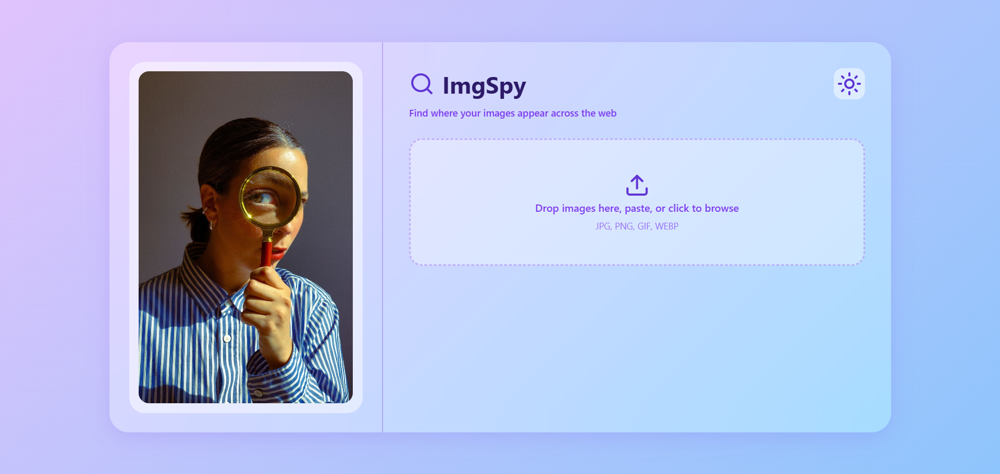
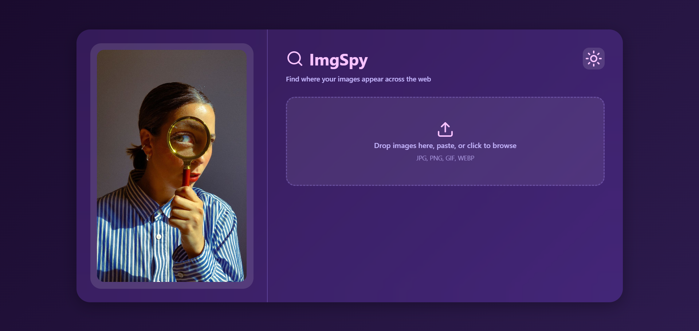
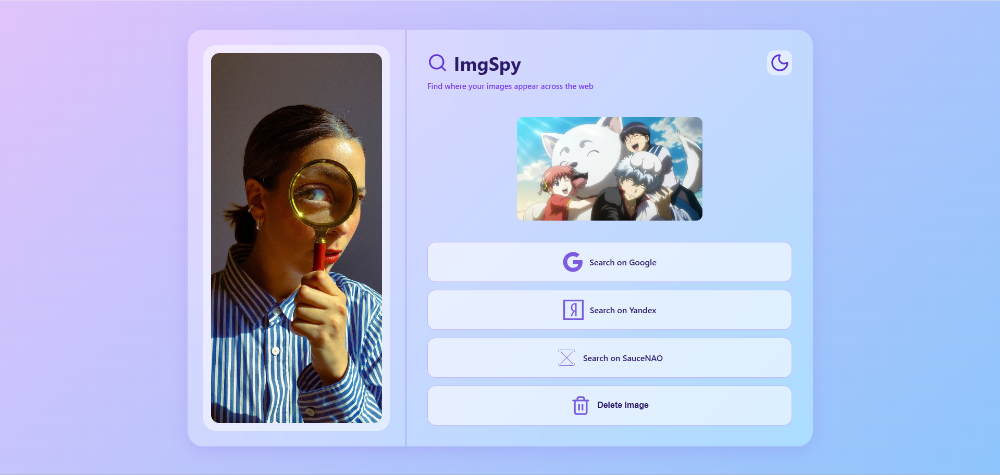
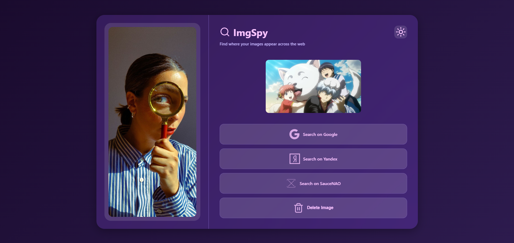
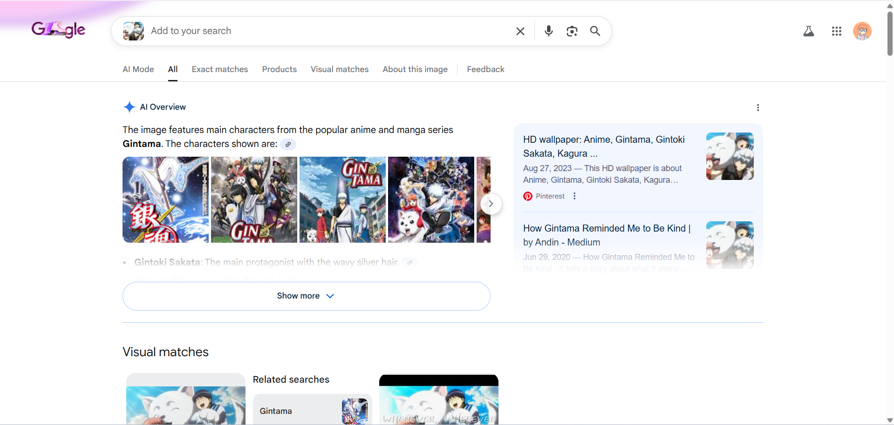
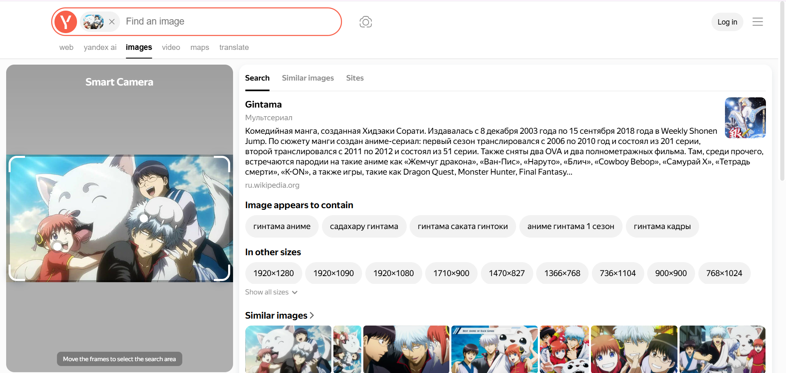
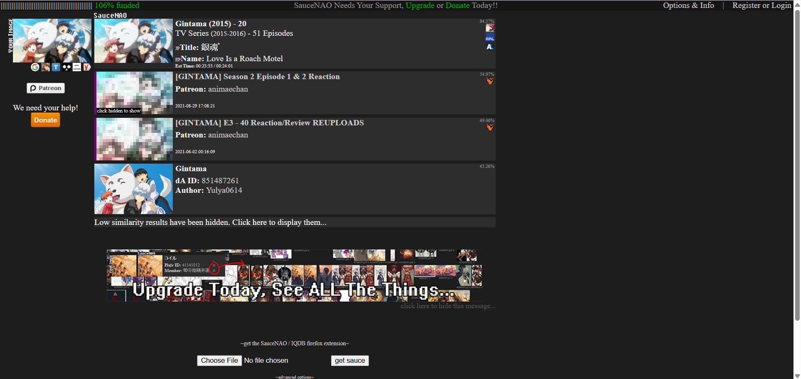

# 🔍 ImgSpy
**A beautiful, privacy-focused reverse image search tool with glassmorphism UI.**
---

## About
**ImgSpy** is a lightweight, client-side reverse image search tool that helps you find where your images appear across the web. Built with vanilla JavaScript and featuring a stunning glassmorphism design inspired by iOS 26 aesthetics.

### Why ImgSpy?
- **Privacy First** - All processing happens in your browser.
- **Fast & Lightweight** - No heavy frameworks or dependencies.
- **Beautiful UI** - Glassmorphism design with dark/light themes.
- **Free & Open Source** - No API keys or accounts required.
---

## Features
### Image Upload
- **Drag & Drop** - Simply drag images into the upload area.
- **Click to Browse** - Traditional file picker support.
- **Paste from Clipboard** - Ctrl+V to paste images.
- **Single File Focus** - Clean, focused search experience.

### Search Engines
- **Google LensS** - Search on Google's vast image database.
- **Yandex Images** - Alternative search with Yandex's engine.
- **SauceNao Images** - High-accuracy reverse search for artwork, anime, and manga sources (Pixiv, ArtStation, etc.).

### Privacy & Storage
- **Temporary Upload** - Images auto-delete after 1 hour.
- **No Tracking** - Zero analytics or user tracking.
- **Client-Side Processing** - Your images stay private.
- **Powered by Litterbox** - Reliable temporary file hosting.
---

### Screenshots
**Light Mode**

**Dark Mode**

**Add Image**
- Light Mode

- Dark Mode

**Search Results**
- Google

- Yandex

- SauceNao

---

## Usage
1. **Upload an Image**
   - Drag and drop an image.
   - Click the upload area to browse.
   - Paste from clipboard (Ctrl+V).

2. **Search**
   - Click "Search on Google" for Google Lens. 
   - Click "Search on Yandex" for Yandex Images.
   - Click "Search on SauceNao" for SauceNao Images.
   - Results open in new tabs.

3. **Delete & Reset**
   - Click "Delete Image" to remove and start over.
   - Upload a new image anytime.
---

### Planned Features
- More search engine integrations (Bing, TinEye)

## [Try it out](https://adarshakarki.github.io/Imgspy/)